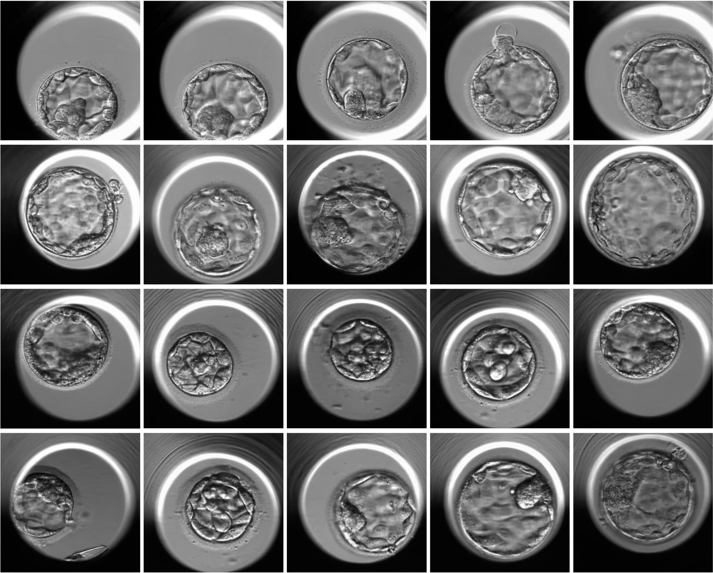

# StyleEmbryo
These are samples of generated human blastocyst images.



This repository was created to provide the original implementation for the paper _"Generative Artificial Intelligence Models to Assist Embryo Selection"_.
In this repository, you will find the code used for training. Here is a basic summary of the directories in this repository:

- **images/**: Samples of generated images.
- **metrics/**: Scripts for FID/KID calculation.
- **results/**: Visual Turing Test results.
- **training/**: Scripts for training.
- **weights/**: Link to pretrained weights.

The training data is available at [link](https://drive.google.com/file/d/1oFrAzSIjW3pbjEhSWswRTIEEb_sqJatT/view?usp=sharing).
The pretrained weights from this study are at [link](https://drive.google.com/drive/folders/1kegtpN3VaC5-irWP6F58qrK9KJrzkbp-?usp=sharing).

# Installation
```
git clone https://github.com/creatorcao/StyleEmbryo.git
cd StyleEmbryo
```

```
conda env create -f environment.yml
conda activate stylegan3
```

# Training 
The training configuration doc in this study can be found here [link](https://github.com/creatorcao/StyleEmbryo/blob/main/training/train_help.txt). 

1. Baseline model
```
python train.py --outdir=./output_gan --data=./embryoGAN256.zip --cfg=stylegan3-t --aug=noaug --gpus=4 --batch=32 --gamma=2 \
    --freezed=13 --workers=2 --mirror=0 --kimg=5000 --tick=2 --snap=50 --metrics=none --cbase=16384 
```

2. Baseline+AUG model
   
```
python train.py --outdir=./output_gan --data=./embryoGAN256.zip --cfg=stylegan3-t --gpus=4 --batch=32 --gamma=2 \
--freezed=13 --workers=2 --mirror=1 --kimg=5000 --tick=2 --snap=50 --metrics=none --cbase=16384 
```

3. Pretrained-T model

```
python train.py --outdir=./output_gan --data=./embryoGAN256.zip --cfg=stylegan3-t --aug=noaug --gpus=4 --batch=32 --gamma=2 \
--freezed=13 --workers=2 --mirror=0 --kimg=5000 --tick=2 --snap=50 --metrics=none --cbase=16384 \
--network=./weights/stylegan3-t-ffhqu-256x256.pkl
```

4. Pretrained-T+AUG model
   
```
python train.py --outdir=./output_gan --data=./embryoGAN256.zip --cfg=stylegan3-t --gpus=4 --batch=32 --gamma=2 \
--freezed=13 --workers=2 --mirror=1 --kimg=5000 --tick=2 --snap=50 --metrics=none --cbase=16384 \
--network=./weights/stylegan3-t-ffhqu-256x256.pkl
```

5. Pretrained-R+AUG model
   
```
python train.py --outdir=./output_gan --data=./embryoGAN256.zip --cfg=stylegan3-r --gpus=4 --batch=32 --gamma=2 \
--freezed=13 --workers=2 --mirror=1 --kimg=5000 --tick=2 --snap=50 --metrics=none --cbase=16384 \
--network=./weights/stylegan3-r-ffhqu-256x256.pkl
```

# Generating image 

```
python gen_images.py --outdir=./images --trunc=1 --seeds=100 \
    --network=./weights/network-snapshot-025000.pkl
```

# Calculating metrics
```
python calc_metrics.py --metrics=fid50k_full,pr50k3_full,kid50k,is50k --data=./embryoGAN256.zip --mirror=1 --gpus=1 \
    --network=./weights/network-snapshot-025000.pkl
```
To replicate the result plots, we provided a notebook tutorial. See [Colab notebook](https://github.com/creatorcao/StyleEmbryo/blob/main/figures.ipynb).

# References
- Alias-Free Generative Adversarial Networks. Tero Karras, Miika Aittala, Samuli Laine, Erik Härkönen, Janne Hellsten, Jaakko Lehtinen, Timo Aila. [https://nvlabs.github.io/stylegan3](https://nvlabs.github.io/stylegan3)
